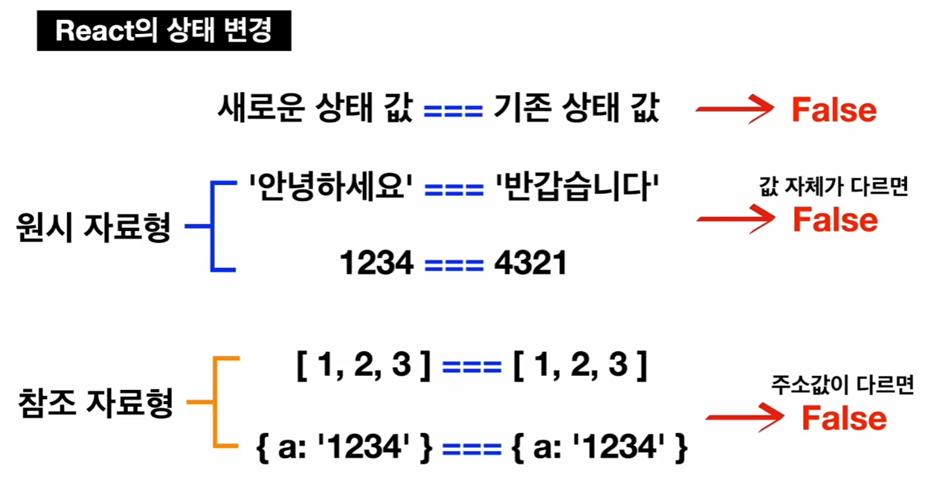

# TIL React 상태 관리 기초 학습(2)
## React 상태변경 특징
1. 상태 변경 함수 사용
2. 새로운 상태 값이 기존 상태 값과 달라야함 === React 불변성 지키기
    * 만약 새로운 상태값과 기존 상태값이 같다면 상태가 변하지 않게되고   
    상태가 변하지 않았으니 화면이 업데이트 되지 않는 결과 발생
3. 새로운 상태 값 === 기존 상태 값 -> False
### 자료형 종류별 특징
1. 원시 자료형( Primitive Data Type ) : 불현하는 단순한 데이터로 변수에 값 자체 저장
2. 참조 자료형( Reference Data Type ) : 가변하는 복잡한 데이터로 변수에 메모리 주소 저장
    * 원시 자료형은 같은 값을 비교 했을 때 true가 나오지만   
    참조 자료형은 같은 담고 있는 주소가 다르기 때문에 false가 나옴
### React 상태 변경
React에서 상태 변경을 할 때 새로운 상태와 기존 상태값이 다르다는 것을 판별하는 방법은  
자료형의 특징과 같다  
새로운 상태값과 기존의 상태값을 비교해봤을 때 False가 뜬다면 두개의 상태값이 다르다라고 판별을 해서 상태값을 업데이트 하게 된다

리액트는 기본적으로 상태를 변경할 때 원래 상태와 똑같다면   
상태를 변경시키지 않아서 불필요한 리렌더링을 막아주고 있음

참조자료형은 이러한 특성을 제대로 이해하고 있지 않으면 내 의도와는 다르게 똑같이 생긴  
참조자료형을 전달해도 상태가 바뀌면서 리렌더링이 발생할 수 있기 때문에 주의해야함

반대로 참조자료형을 상태로 사용하고 있을 때 해당 상태를 가공해서 상태 변경을 시도한다면  
그 자료형의 주소 자체는 바뀌지 않기 때문에 반대로 상태가 바뀌지 않고 리렌더링이 발생하지 않을수 있음

## React 상태 변경 방법
1. 기존 상태를 복사하여 가공 
    * Spread Syntax 
    * Array.slice( ) 
    * Object.assign( )
2. 새로운 배열을 리턴하는 고차 함수 메서드 사용 
    * Array.map( ) 
    * Array.filter( )
