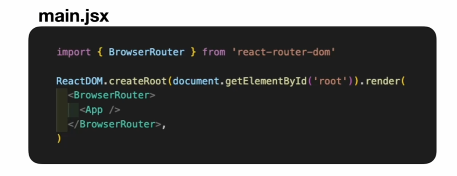

# TIL React SPA
## React 조건부 렌더링
조건부 렌더링 : 특정 조건에 따라 다른 컴포넌트나 요소를 렌더링 하는것  
조건문과 논리 연산자 활용

### React Router
1. React에서 SPA 방식으로 라우팅 할 수 있게 해주는 라이브러리
2. npm i react-router-dom으로 설치
### Routing 이란?
요청 주소에 맞는 화면을 보여주는 것  
**MPA 라우팅**
사이트 메인 페이지 진입 -> 서버에서 완성된 메인 페이지의 html을 클라이언트에게 전달 ->   
클라이언트에서 html 표시 -> 사용자 마이페이지 접근 ->   
서버는 마이페이지 hmt형식을 완성된 형태로 또 클라이언트로 보냄 ->  
클라이언트에서는 html을 화면에 표시 ->   
완전히 새로운 구조의 html을 다시 그리는 식으로 화면 전환이 발생 -> 새로고침 발생 -> 플리커현상 발생  
**SPA 라우팅**  
맨처음 서버에서 빈 html과 메인페이지를 그리기 위한 자바스크립트 파일을 받아온 다음에 두 파일을 조합해서 메인페이지 그림 ->  
클라이언트가 마이페이지에 접근 -> 마이페이지로 이동하면서 화면에 변경 필요한 부분 발생 ->  
클라이언트는 이부분에 필요한 데이터를 서버에서 받아오게 되고 이 데이터를 활용해서 마이페이지를 그려내게 됨 ->  
필요한 부분만 리렌더링 하여 새로고침이 발생하지 않음 
## React Router 주요 컴포넌트
1. `<BrowserRouter>` : React Router를 사용하고 싶은 곳을 감싸서 사용
    * `<APP>`을 감싸면 어디서든 사용 가능
    * React Router를 사용하고 싶은 위치가 `<BrowserRouter>`의 자식 컴퍼넌트로 속해있어야 React Router의 기능 사용가능

아이디가 루트인 요소를 가져다가 앱 컨퍼넌트를 랜더링해주고 있는 코드가 있는데,  
이때 실질적으로 이 앱 컴포넌트가 리액트 어플리케이션의 전체라고 보면 됨  
그래서 이 앱 컴포넌트를 `<BrowserRouter>`를 가져와서 감싸주면 만들고있는 리액트앱의 전체에서 React Router의 기능을 사용할 수 있게 됨  
보통 React Router를 설치하여 사용할 때에는 main.jsx에서 앱 컨퍼넌트를 감싸주는 형식으로 많이 사용
2. `<Link>` : `<Link>`컴포넌트와 to 속성을 사용하여 이동하고 싶은 주소로 이동 가능
    * 원래 html상 a요소는 클릭했을 때 새로고침이 발생하게 되지만(a요소의 기본 작동 방식),   
리액트 라우터의 링크 컴퍼넌트는 표시는 a요소로 되지만   
**클릭했을 때 새로고침은 적용되지 않고 브라우저의 주소만 변경**됨
3. `<Routes>`&`<Route>`  
Routes : Route 컴포넌트들을 묶어주는 역할  
Route : 특정 주소에서 어떤 컴퍼넌트를 보여줄 지 정해주는 역할
    * Path 속성에 작성된 주소에 접근 시 element 속성에 작성된 컴퍼넌트를 화면에 보여주게 됨  
모든 방식 SPA 방식으로 일어남

## React Router 주요 함수
1. useNavigate() : 특정 주소로 이동할 수 있게 해주는 함수 생성
    * 작성 방법  
const navigate = useNavigate()  
navigate(/main)// main으로 이동  
navigate(1)// 앞으로 가기  
navigate(-1)// 뒤로 가기  

```
<button onClick={() => navigate(-1)}>{`<-뒤로 가기`}</button>
<button onClick={() => navigate(1)}>{`앞으로 가기->`}</button>
```
2. useLocation() : 현재 페이지의 위치 정보를 담고있는 객체 생성
    * 작성 방법  
    const location = useLocation()  
    location.pathname 현재 경로명
    location.search 쿼리 문자열
```
const location = useLocation();
console.log(location);
console.log(location.pathname);
//이 값으로는 /뒤에 오는 주소가 나옴(예: '/main')
console.log(location.search);
```
3. useParams() : 주소의 쿼리 파라미터 값을 담은 객체 생성
    * 작성 방법  
    const params = useParams()  
    params.name name이라는 이름으로 들어온 값
```
const params = useParams()
  console.log(params.name)
```
4. useSearchParams() : 주소의 쿼리 스트링 값을 가져올 수 있는 객체(searchParams)와 쿼리 스트링을 수정할 수 있는 함수(setSearchParams) 생성
    * 작성 방법  
    const [searchParams, setSearchParams] = useSearchParams()  
    searchParams.get("name") name으로 들어온 쿼리 스트링   
    setSearchParams({name : " 아윤"} ) name 쿼리 스트링 수정
```
const [searchParams, setSearchParams] = useSearchParams()
  console.log(searchParams.get("name"))
  console.log(searchParams.get("school"))
```