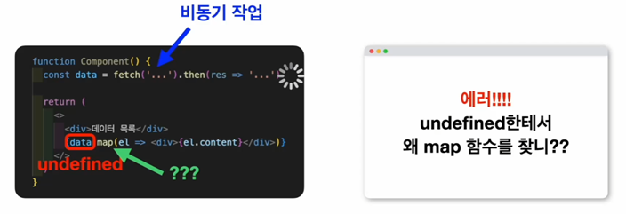
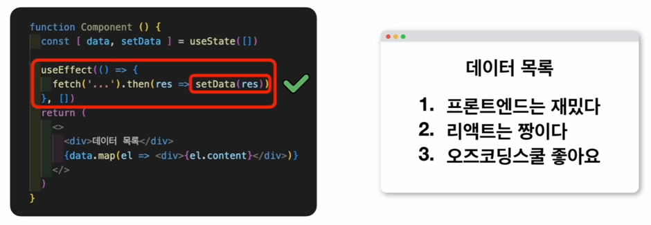

# TIL React Hooks
## React 컴포넌트의 생명 주기
생명주기란? 한 삶이 시작되고 끝나는 사이클

컴포넌트 기준으로 태어나는 것은 화면에 처음 나타날때(**Mount**)  
컴포넌트의 생명주기가 끝나는 것은 그 컴포넌트가 화면에서 사라질 때(**Unmount**)  
Mount 되고 Unmount 되는 사이의 시점에서는 상태가 업데이트 되면서   
화면도 업데이트 되는 과정 여러 번 반복   
이 모든 과정을 묶어서 **컴포넌트의 생명주기**라고 부름

### Class 컴포넌트의 생명주기
1. Class 컴포넌트 정의
2. 정의한 인스턴스 생성(= 화면에 표시됨)
3. 상태 변경 시 인스턴스의 내부 값 변경
4. 바뀐 값에 맞춰 리렌더링
5. 사용하던 인스턴스가 더 이상 화면에 필요 없어짐 -> 사용 안함
6. 생명주기 끝
* 만약 똑같은 Class 컴포넌트를 다시 표시한다면?  
새로운 인스턴스 생성 -> 생명주기 다시 거침
* 생명주기 메소드   
생성 : componentDidMount/ 업데이트 : componentDidUpdate/ 제거 : componentDidUnmount 사용

### 함수 컴포넌트의 생명주기
1. 함수 컴포넌트 정의
2. 정의한 함수 호출(= 화면에 표시됨)
3. 함수컴포넌트에서 상태 변경 시 앞서 호출했던 함수는 더 이상 사용하지 않고   
새로운 상태 값으로 함수 호출
4. 새롭게 호출된 함수 화면에 표시 
5. 기존 함수는 사라지고 새로운 함수 호출로 완전히 대체
6. 화면에서 사라지고 필요 없어지면 더 이상 사용 안함
* 만약 똑같은 Class 컴포넌트를 다시 표시한다면?  
  화면에 다시 표시할 땐 함수를 호출
* 함수 컴포넌트는 생명주기 메소드가 사실 상 useEffect 하나만 있음

## React Hooks-useEffect
1. useEffect에 첫번째 인자인 함수만 전달
```
useEffect(() => {console.log("useEffect")})
```
컴포넌트가 처음 표시될 때, 컴포넌트가 업데이트 될 때 두가지 경우의 수에서만 실행  
컴포넌트가 리렌더링 될 때 모든 경우의 수에서 실행

2. useEffect의 두번째 인자로 빈배열[] 전달
```
useEffect(() => {console.log("useEffect")}, [])
```
컴포넌트가 처음 화면에 렌더링 될때에만 실행

3. useEffect의 두번째 인자로 값 전달
```
useEffect(() => {console.log("useEffect")}, [counter2])
```
전달된 값이 변경 될 때 useEffect가 다시 호출   
특정 상태값이 변할때만 조작

4. return할때 배열에 값 전달
```
useEffect(() => {console.log("useEffect");return () => {console.log("returned function");};}, [counter2]);
```
* 함수 컴포넌트의 생명주기 = 리렌더링 되면 기존에 리턴됐던 함수는 버리고 완전히 새로운 함수 호출
* counter2의 상태가 변경될 때 마다 리렌더링이 발생하는거니까  
이전에 있던 컴퍼넌트는 없어지고 새로운 컴포넌트가 만들어짐
* 컴포넌트가 없어지는 단계가 들어가 있으므로 counter2 상태가 변경되면서   
컴포넌트가 없어지는거에는 return된 함수가 호출되는것

5. return할 때 빈배열 전달
``` 
useEffect(() => {console.log("useEffect");return () => {console.log("returned function");};}, []);
```

* 상태를 변경 시켜도 함수가 표시되지 않음
* show 버튼을 눌러서 컴포넌트를 없애면 최종적으로 컴포넌트가 없어질때  
```return () => {console.log("returned function");};``` 이 함수가 표시됨

6. 두번째 인자로 아무것도 넣지 않았을 때
```
useEffect(() => {console.log("useEffect");return () => {console.log("returned function");};});
```
모든 상태에서 리렌더링이 발생할 때 무조건 returned function이 됨

7. 컴포넌트가 리렌더링 되거나 Unmount 될때에만 특정한 조작을 하고 싶을 때
```
useEffect(() => {return () => {console.log("returned function");};}, []);
```
컴포넌트가 Mount되고 상태가 변경이 되어도 아무런 작동을 하지 않다가 컴포넌트가 Unmount 될 때에만 작동
컴포넌트가 최종적으로 Unmount 될 때 조작

### 주의할 점
1. 함수 컴포넌트는 리렌더링이 발생할 때에도 컴포넌트가 없어지는 단계가 있음  
리렌더링이 개입되지 않고 컴포넌트가 실제로 마지막에 사라질 때에만 조작을 해주고 싶다면 두번째 인자로 빈배열을 전달해야함  
2. return 함수를 작성할 때에는 이 컴포넌트가 언제 Unmount 되는지를 적절하게 인지하고 어떤때 조작을 해줘야겠다라는 걸 정확하게 타겟팅하고 코드를 작성할 수 있어야 함

## React 생명 주기 함수의 필요성_서버에서 데이터를 받아올 때
생명주기 함수를 사용하는 대표적인 경우
### 서버에서 데이터를 받아올 때
* 예시  

데이터를 받아오지 않은 상태에서의 데이터에 들어있는 값
	* 함수가 선언만 되고 할당이 아직 되지 않아 undefined 값이 들어있음
    * undefined에는 map이라는게 없으니 에러가 뜸

* useEffect 사용 시


1. 컴포넌트가 처음 렌더링 됐을 때 데이터가 없는 상태에서 리액트 컴포넌트는 화면을 표시하려고 시도
2. 초기값으로 빈배열이 들어있음
3. 빈배열은 비어있긴 하지만 일단 배열이기 때문에 map 함수 사용 가능
4. 비어있는 화면이긴 해도 일단 데이터 없이 표시할 수 있는 화면은 브라우저에 나타남 
5. 컴포넌트가 맨 처음 실행
6. useEffect 함수 실행
7. 패치해오는 동안 시간 걸림
8. 패치가 완료되서 데이터를 다 받아오면 그 데이터를 사용해서 상태 업데이트
9. 상태가 업데이트 되면 화면 리렌더링 발생 
10. 리렌더링 되면서 데이터 화면에 표시 됨
### <사용하는 이유>
1.	useEffect 사용하여 데이터가 아예 없어서 undefined가 들어가 있는 상황에서 화면을 렌더링 하려고 했을 때 발생했던 에러 화면이 나타나지 않게 할 수 있음
2.	설령 데이터가 아직 불려오지 않은 상황이라고 해도 데이터 없이 표시할 수 있는 화면은 미리 화면에 렌더링 되기 때문에 사용자가 빈 화면을 보면서 기다리는 일이 발생하지 않음
3.	상태를 업데이트 함으로써 리렌더링을 발생 시키는 것이기 때문에 리액트의 기본 작동 방식과도 잘 맞물리는 방식으로 코드가 작성됨

