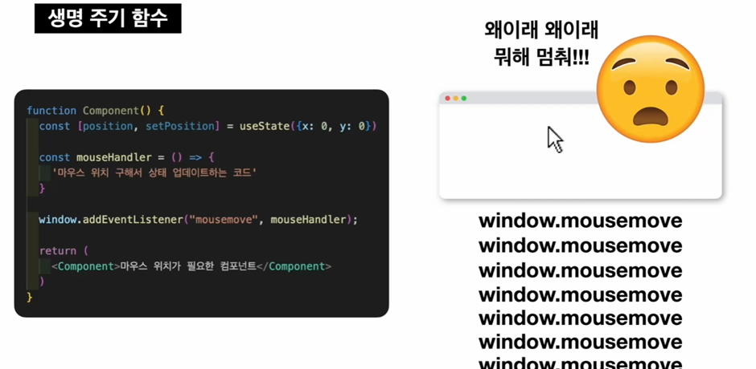
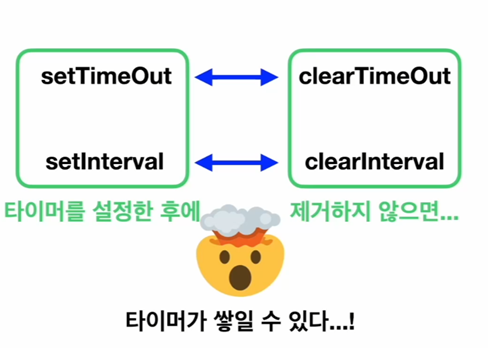
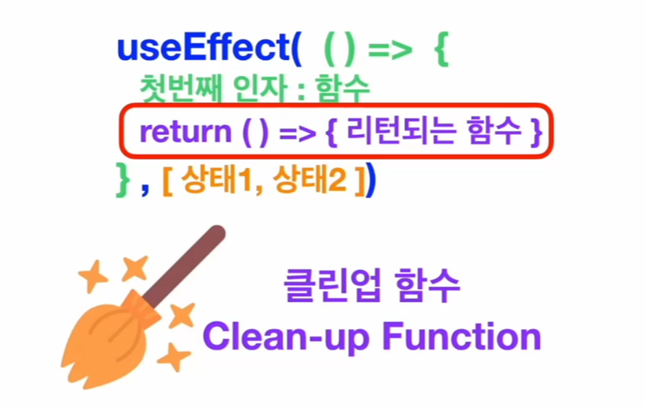

# TIL React Hooks(2)
## React 생명 주기 함수의 필요성_이벤트 핸들러를 사용할 때
### 예시

1. 컴포넌트가 처음 랜더링 되면서 함수 안에 있는 모든 코드들이 모두 실행됨 
2. mousemove 이벤트가 맨처음 한번 걸리게 됨
3. 마우스가 살짝 이동 
4. 마우스가 움직이면서 상태 업데이트 됨  
5. 상태가 업데이트 됨으로써 컴포넌트가 완전히 새롭게 호출됨  
(리랜더링이 된다는건 기존의 함수를 버리고 새로운 함수를 호출하는 것)
6. 함수가 호출되면 함수 안에 있는 코드들이 또 실행 됨
7. 함수 안에 마우스무브 이벤트에 이벤트 핸들러를 걸어주는 함수가 있음
8. 리랜더링 되면서 마우스 무브 이벤트가 또 걸리게 됨
9. 마우스가 움직일 때마다 이벤트가 중첩되어 걸림
10. 브라우저 입장에선 똑 같은 동작을 하는 이벤트 리스너가 계속 중복으로 걸려서 굉장히 비효율적
11. 리액트 입장에서도 이벤트 리스너가 많이 걸려있으면 마우스를 조금만 움직였을 때 상태를  
업데이트 하는 함수가 그만큼 많이 호출 됨(바람직하지 않은 상황) 

useEffect 함수 사용시
이벤트 리스너가 중복으로 붙지 않고 컴포넌트 리랜더링에 맞춰서 단 하나의 함수만 유지되게 함  
useEffect를 사용하면 이벤트 리스너가 중복으로 붙는 현상이 없어짐  
윈도우에 이벤트 핸들러를 걸어야 할 때  
(마우스의 위치를 구해야 한다거나, 스크롤의 위치를 구해서 사용해야 한다거나, 윈도우 창의 크기를 구해서 사용해야 한다거나)  
useEffect를 사용해서 이벤트리스너가 중복으로 붙지 않도록 처리해주는게 보통임

## React 생명 주기 함수의 필요성_타이머 함수를 사용할 때
### 예시
타이머 함수를 사용하면 타이머를 제거하는 함수도 사용할 수 있는데, 
Clear로 제거할 수 있다.

  
제거하지 않으면 타이머도 이벤트핸들러처럼 쌓일 수 있음  
그래서 리액트 컴퍼넌트 안에서 타이머를 사용해야 하면 이벤트 핸들러를 사용했을 때와  
마찬가지로 컴포넌트가 랜더링 될 때에는 타이머를 설정할 수 있도록  
컴포넌트가 Unmount 될 때에는 타이머를 제거할 수 있도록 코드를 작성해줘야 복잡한 경우가 발생하지 않음

useEffect의 첫번째 인자인 함수가 리턴하는 함수는 컴포넌트가 Unmount 될 때 실행  
-> 이 리턴되는 함수는 이벤트 핸들러를 걸거나 타이머 함수를 설정하거나 이럴 때 이것들을 치우고 나오는 역할을 하고 있음   

Clean-up Function(클린업 함수) : useEffect의 첫번째 함수가 리턴하는 함수  
* useEffect가 뭔가 버려두고 나온거를 잘 치워주는 역할  
* 깔끔하게 코드를 사용하고 싶으면 클린업 함수를 사용

## React Hooks-useRef
### 사용하는 상황
1. DOM 주소를 직접 가져올 때
2. 리렌더링 되어도 초기화되지 않는 변수가 필요할 때
### 주의 사항
React는 기본적으로 가상 DOM을 통해 실제 DOM 조작  
하지만 useRef는 바로 실제 DOM을 조작하기 때문에 React 기본 작동 방식과 다르므로,
꼭 필요할 때만 써야함
### 사용방법
```
const domRef = useRef(null)//DOM주소 담을 공간 만들기(처음에는 빈공간으로 만들기)

<element ref={ domRef } />//DOM주소 담고 싶은 요소에 ref 속성으로 연결

domRef.current === <element ref={ domRef } />//current 속성으로 요소 접근 가능
```
## React Custom Hooks
### Hook이란?
React 함수형 컴포넌트에서 쓸 수 있는 함수로 use로 시작하는 이름을 가짐  
### Custom Hook
Hook으로 사용하고 싶은 코드를 마음대로 코드를 짜고 마음대로 이름을 붙혀줄 수 있음  
### 장점
1. **코드 간결성, 재사용성 높아짐**  
프로젝트를 하다보면 똑같은 로직이 중복적으로 생기는 경우가 많은데,  
이렇게 중복되는 코드를 하나의 Custom Hook으로 묶어서 사용하면 직접 만든 Hook 함수를 쓰고 싶은 곳에서  
가져와 쓰기만 하면 되는거기 때문에 중복되는 코드는 하나로 묶인 Hook 그 안에만 들어있고  
함수만 가져다 쓰면 되어 코드도 간결해지고 Hook 함수를 가져다 쓰는 재사용성도 높아짐
2. **코드 가독성 높아짐**  
똑같은 코드를 계속 볼 필요 없이 함수가 어떤 건지 기억을 하고 있으면  
코드만 딱 봐도 뭘 하는 코드인지 바로 알 수 있어 코드 가독성이 높아짐
3. **유지보수성 좋아짐**  
코드가 만들어놓은 Custom Hook 안에 들어있기 때문에 Custom Hook의 코드만 수정하면  
Hook을 가져다 사용하는 모든 곳에 영향을 주어 중복된 코드를 일일이 찾아다니면서  
수정할 곳을 일일이 수정할 필요가 없어지고 Custom Hook만 수정하면 되니까 유지와 보수가 훨씬 쉬워짐

