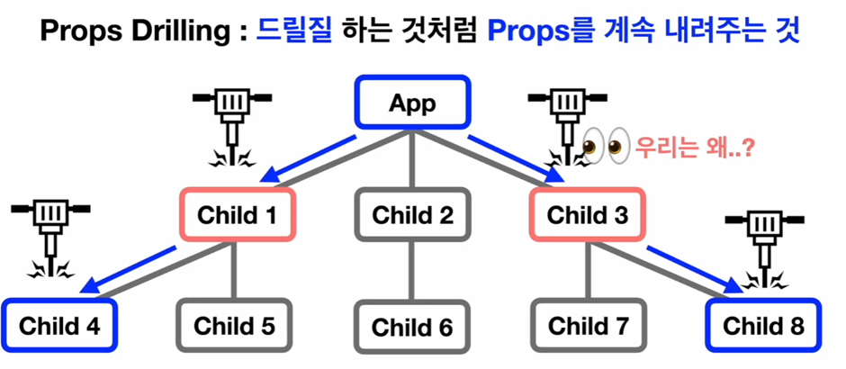

# TIL React 상태관리 심화 - React 전역 상태 관리
## React 상태 관리
React는 대표적인 SPA 라이브러리이다.  
React가 SPA를 구현할 때 상태 변경을 통해 리 렌더링 되는 방식을 사용한다.  
그만큼 상태를 잘 관리하는 것이 매우 중요하다.
## React의 상태를 관리하는 방법
### 내부
1. useState
2. Context API
### 외부
1. Redux, Redux Toolkit
2. Recoil
3. MobX
4. Zustand
5. Jotai
* 이 중에서 useState를 제외한 모든 방법들은 **React의 전역 상태를 관리** 할 수 있게 도와주는 도구들이다.
## Props Drilling이란?
드릴질을 하는 것처럼 Props를 계속 내려주는 것

### useState만 사용 시
* 부모 컴포넌트에서 바로 아래의 자식 컴포넌트에게 상태를 내려주는 경우
    * 굉장히 자연스럽고 이상이 없는 상태 구조가 완성

* 자식 컴포넌트가 또 다른 자식 컴포넌트를 가지게 되는 경우
    * 하나의 자식 컴포넌트( Child1 ) 에 존재하는 두개의 자식 컴포넌트( Child4, Child5 )가  
      같은 상태를 사용해야 할때에는  
      이 두값에 동시에 props를 내려줄 수 있는 Child1 에서 상태를 만들고 관리하며 됨  
    *  이 경우에 바로 아래에 있는 props에 상태를 내려주기 때문에 아무런 이상 없이 사용 가능  

* 떨어져 있는 자식 컴포넌트끼리 같은 상태를 사용해야 할 때
    * Child4와 Child8에서 같은 상태를 사용해야 한다면 App에서 상태를 만들어서 내려주어야 함  
    (다른 곳에서 만들면 동시에 내려줄 수 없음)  
    * 이런 상황에서 Child1과 Child3는 밑에 있는 컴포넌트에 상태를 내려주기 위한 목적으로만 상태를 내려받게 됨   
    -> 오로지 전달을 위한 목적으로만 사용  
    * 위에 경우는 두번밖에 내려받지 않기 때문에 크게 복잡하지 않은 상황이지만,  
       이것보다 더 복잡한 구조의 컴포넌트들이 연결되어 있으면  
       내려주는 컴포넌트들뿐만 아닌 App도 자신이 사용하지 않을 컴포넌트를 들고 있기 때문에 같이 피해를 받음
    * **Props drilling이 과하게 발생**  

## 단점
1. 똑같은 상태를 공유해야 하는 컴포넌트들이 여러 개 있다면  
App이 굉장히 무거워지고 코드도 복잡해지고 개발자 입장에서도 좋지 않음

2. 리렌더링 시 App에서 내려받은 자식 컴퍼넌트들이 리렌더링 되기 때문에  
리렌더링이 불필요한 컴포넌트들까지 다 리렌더링 됨

## 정리
1. Props drilling 자체는 자연스러운 현상
2. 상태를 체계적으로 설계해서 사용하면 useState만으로도 규모있는 애플리케이션 생성 가능
3. 설계를 아무리 잘 했더라도 너무 과하게 발생 시 코드 지저분해지고 관리 어려움
4. 따라서 여러 컴포넌트에서 상태를 사용해야 할 때  
-> 전역 상태 관리가 필요할 때에는 사용할 수 있는 도구가 필요해짐  
-> 그래서 생긴게 Context API, Redux, Redux Toolkit 등임

## 전역 상태 관리의 필요성
* 전역 상태 관리 도구를 사용하면 **전역 상태 저장소** 라는 별도의 공간을 만들어 상태를 만들어놓고 관리
* 상태가 필요한 컴포넌트는 저장소에서 상태를 직접 꺼내와서 사용

    * App 입장에선 상태를 꼭 만들어서 내려주지 않아도 되어서 편하고  
    자식 컴포넌트들은 내려주는 역할이 필요 없어짐  
    * 개발자 입장에서도 전역 상태 저장소를 통해 꺼내 쓰면 되기 때문에 편리해짐

