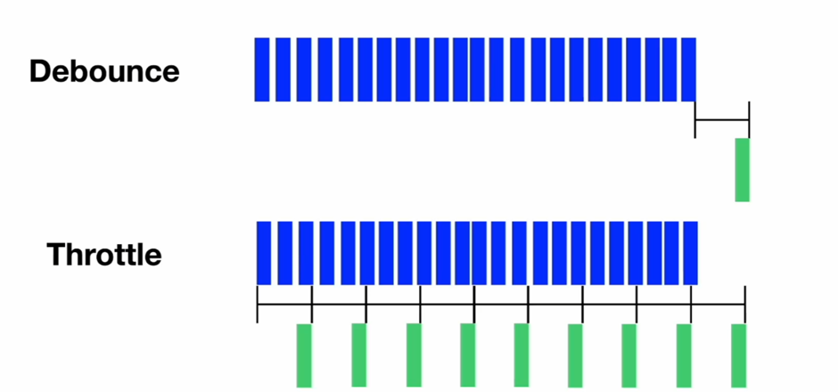

# TIL React 최적화
## React lazy & Suspense
### lazy
```
import Main from "./Main.jsx"
const Main = lazy(() => import("./Main.jsx"));
```
* 컴포넌트를 바로 불러오지 않고, 실제로 그 컴포넌트가 필요할 때 불러옴

* lazy라는 함수의 인자로 함수 전달

* 리턴하는 것은 import라는 함수가 컴포넌트가 있는 위치를 인자로 전달받는 형태  
그럼 컴포넌트를 실제로 화면에 렌더링 해야할 때 로딩 해올 수 있게 됨
### Suspense
```
<Suspense fallback={"로딩중...."}>
<Main />
</Suspense>
```
* 컴포넌트를 불러오는 동안 사용자에게 보여줄 임시 화면 설정

* 컴포넌트를 리액트에서 꺼내와서 사용

* 자식 컴포넌트로 Lazy를 사용해서 import해온 컴포넌트를 넣어줌  
그러면 이 컴포넌트가 로딩 될 때 까지 Suspense의 fallback에 작성된 화면이 임시 화면으로써 표시됨 

## 번들링&코드 스플리팅

### 번들링(Bundling)
* 여러 개의 파일(JavaScript, CSS 등)을 하나의 파일로 합치는 것

### 번들링의 효과
1. HTTP 요청의 수를 줄여 속도 향상

2. 코드를 압축해 파일 크기 축소

3. 사용되지 않는 코드 제거에 최적화

### 번들링 도구 종류
* Vite -> Rollup
    * Vite 는 터미널에 npm run build 입력하여 번들링 가능
    * dist라는 폴더 자동 생성되고 거기에 assets에 번들링 된 파일들 들어있음

* CRA -> Webpack

### 코드 스플리팅 (Code Splitting)
* 애플리케이션의 코드를 여러 개의 작은 부분으로 나누는 것

### 코드 스플리팅의 효과
1. 초기 로딩 속도 개선

2. 불필요한 코드 로드 방지

3. 데이터 비용 절감 효과


#### 중요
* 번들링은 기본적으로 진행하면서 필요한 부분만 작게 나눠놓는 것을 의미

* 번들링과 함께 코드 스플리팅을 하게 되는 것

* React의 lazy & Suspense도 대표적인 코드 스플리팅 방법
    * 리액트의 컴포넌트 코드만 스플리팅 가능

* node_modules 스플리팅 코드
```
build: {
    outDir: "docs",
    rollupOptions: {
      output: {
        manualChunks: (id) => {
          if (id.indexOf("node_modules") !== -1) {
            const module = id.split("node_modules/").pop().split("/")[0];
            return `vendor-${module}`;
          }
        },
      },
    },
  }
```

* 해당 module을 사용하는 곳에서만 스플리팅 가능 -> 로딩속도 최적화

## Debounce & Throttle
* 연속적으로 발생하는 함수나 이벤트를 묶어서 처리하는 방식
    * 최적화를 통한 성능 향상 목적
* 함수나 이벤트를 처리해야 하는데 모든 함수나 이벤트를 다 처리한다면 그만큼 작업을 많이 해야함
* 이때 묶어서 덩어리로 처리한다면 그만큼 횟수가 줄어들어 최적화되고 성능 향상 됨

### 연속적 이벤트 발생 시

#### Debounce
* 함수나 이벤트가 연속적으로 발생하는 동안 쭉 지켜보고 있다가 마지막에 발생하는 이벤트만 처리

#### Throttle
* 연속적으로 이벤트나 함수가 발생하는 동안 일정한 텀을 가지고 처리

### 비연속적 이벤트 발생시
.png)
#### Debounce
* 이벤트가 일어나는 것을 지켜보다가 마지막에 이벤트 처리

#### Throttle
* 특정 텀을 가지고 이벤트를 묶어서 처리

### 사용예시
#### Debounce
* 마지막에 한 번에 묶어서 처리해도 상관 없을 때
    * ex. 검색 자동 완성

#### Throttle
* 중간 중간 끊기지 않는 인터랙션이 필요할 때
    * ex. 마우스 이동, 스크롤 이벤트 등