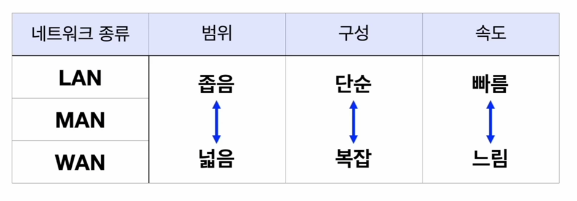

# TIL 네트워크 기초
## 네트워크
* 데이터를 전달하는 범위가 얼마나 넓은지 물리적인 차이에 따라서 네트워크의 규모,  
데이터의 전송 속도와 시간 등 물리적인 차이가 발생할 수 밖에 없음

* 그래서 네트워크를 분류할 때 네트워크의 범위에 따라서 분류 하기도 함
### 네트워크의 종류
1. LAN
    * **가장 작은 단위의 네트워크**

    * 건물 하나나 사무실 같은 작은 단위의 지역을 커버하는 네트워크

    * 가까운 물리적 거리 때문에 보다 더 빠른 속도와 짧은 대기시간을 가짐

2. WAN
    * 도시간, 국가간, 대륙간 통신처럼 긴 거리를 커버하는 **가장 큰 단위의 네트워크**

    * 대기시간과 전송 속도가 김

3. MAN 
    * 도시 전체정도의 네트워크를 담당

    * LAN과 WAN의 중간단위인 만큼 중간정도의 특성을 가짐

### 네트워크 계층
* 가장 대표적인 모델 -> OS1 7계층

* 응용, 표현, 세션, 전송, 네트워크, 데이터 링크, 물리 의 7가지 계층으로 나뉨

* 사용자와 가장 가까운 것이 상위계층인 응용 계층, 가장 먼게 하위계층인 물리계층

* 데이터를 전달하고 받을 때에 상위에서 하위 계층으로, 하위에서 상위 계층으로 이동하는 순서를 거치게 됨 

### 데이터 캡슐화
>데이터는 이동할 때 데이터의 본 형태 그대로 이동하는 것이 아닌  
포장하는 단계와 포장을 뜯는 단계가 추가되는데 계층을 지나면서 포장된 데이터는  
최종적으로 전기신호로 변환되서 목적지로 전달됨

* 캡슐화 : 데이터를 보낼 때 계층을 거치면서 한겹씩 포장하는 것
    * 포장 한겹한겹 에서는 계층에서 데이터를 잘 도착시키기 위해서 필요한 정보를 덕지덕지 붙이는 느낌

* 역캡슐화 : 데이터를 받을 때에는 계층을 거치면서 포장을 한겹한겹 벗기는 것
    * 모든 포장을 벗기면 원본 데이터가 목적지에 도착하게 됨

## HTTP(Hypertext Transfer Protocol)
* 웹 기반 응용 프로그램에서 가장 많이 사용되는 프로토콜

* 웹 프론트엔드 클라이언트와 웹 서버가 통신할 때 http 프로토콜을 사용해서 통신을 하게됨

* 사용자와 가장 가까운 계층인 응용 계층에 포함되는 프로토콜

* 웹서핑을 할 때에는 거의 항상 http 프로토콜을 사용하고 있다

### 클라이언트 - 서버 구조
* 클라이언트가 요청을 하면 서버에서 응답을 주게 됨

* HTTP 메시지 : HTTP에서 클라이언트와 서버 사이에서 오고가는 메시지
    * 요청할 때 보내는 메시지는 요청 메시지, 응답으로 받는 메시지는 응답 메시지 라고도 함

### HTTP 메시지
* 정해진 형식이 있고, 형식에 맞춰야지만 요청과 응답이 제대로 가능

* 정해진 형식에 맞춰 요청을 보내지 않으면 응답이 제대로 돌아오지 않게 됨

* 정해진 형식에 맞춘다고 하더라도 헤더의 종류나 헤더의 값이 유효하지 않으면 응답이 제대로 돌아오지 않을 수 있음

* 헤더 : 헤더 값 형태로 오고감

> 요청과 응답을 주고받을 때 정해진 형식과 값이 있다보니 문서를 작성하는게 난이도가 있을 수 있음  
그래서 서버에 요청을 보낼 때 작성해야 하는 헤더의 종류와 작성할 수 있는 값에 대한 문서가 따로 있음  
 -> **api 문서**  
이 문서를 참고해서 요청 메시지를 작성하면 정해진 형식에 잘 맞춰서 요청을 보낼 수 있게 됨

### HTTP 특징
#### 무상태성(Stateless)
* 상태(서버의 기억)가 없음을 의미

* 클라이언트가 모든 요청을 외우고 있다면 서버에서 기억을 못하더라도 전혀 문제가 없음

* HTTP의 요청이 몰릴 때 서버를 자유롭게 증설할 수 있게 해줌

#### 비연결성(Conectionless)
* 연결(요청과 응답이 오고가는 통로)이 지속되지 않음을 의미

* HTTP는 비용 절약을 위해서 요청과 응답이 한번 오고가면 연결 통로를 끊어버림

* 한번 연결됐을 때 필요한 요청과 응답을 모두 주고받을 수 있도록 지속연결과 같은 방법을 사용하기도 함

* HTTP는 기본적으로 비연결성을 가지지만 여러가지 방법을 사용하여 비연결성 때문에 발생할 수 있는  
 비효율을 해결하려고 노력중
    * 버전이 업데이트 되면서 비효율 해결 중

## HTTPS(HTTP + secure)
* 오고가는 데이터를 암호화 하여 기존의 HTTP 프로토콜보다 더 안전하게 사용할 수 있는 프로토콜 의미
    * 기존의 http는 데이터를 주고받을 때 암호화는 해주지 않기 때문에  
    만약 오고가는 데이터가 도중에 탈취당한다면 데이터가 그대로 들여다 보이는 취약점이 있음

    * https는 데이터가 암호화 되어있기 때문에 중간에 탈취 당하더라도 내용을 전혀 알 수 없음

### 암호화 방식
1. 대칭 키 방식
    * 하나의 키만 존재하며 암호화 하는 키와 복호화 하는 키가 동일함 
2. 비대칭 키 방식
    * 암호화 하는 키와 복호화 하는 키 두개가 존재하며 서로의 암호화, 복호화를 해줄 수 있음

### 인증 방식
1. 인증서 발급 & 검증할 때, 대칭키를 주고 받을 때 -> 비대칭 키 방식

2. 클라이언트와 서버가 데이터를 주고 받을 때 -> 대칭 키 방식

* 서버가 자신의 비밀키를 가지고 있고 클라이언트가 공개키를 가지고 있는 시점에서 공개키와 비밀키를 사용하여 데이터를 주고 받지 않고 굳이 대칭키를 하나 더 만들어서 데이터를 주고 받는 이유

    * 비대칭 키 방식은 복호화 과정이 너무 오래 걸리기 때문

    * 클라이언트와 서버가 연결이 성립되면 서로 굉장히 많은 파일과 데이터를 주고 받게 되는데, 비대칭 키 방식을 사용하면 암호화한 데이터를 복호화하는데 시간이 너무 오래 걸리기 때문에 사이트를 이용하는 데에도 시간이 너무 많이 걸리게 됨

    * 그래서 서로 공개키와 비밀키를 가지고 있음에도 이키들은 데이터를 통신하는데 사용하는 것이 아닌 데이터를 통신하기 위한 대칭키를 주고 받기 위해 사용하게 됨

    * 서로 대칭키를 가지게 되면 데이터를 암호화하고 복호화 하는데 드는 시간을 최소화 할 수 있을 뿐만 아니라 대칭키 자체는 통신을 통해서 오고가는 일이 없기 때문에 키가 탈취당할 위험성이 줄어들게 됨 따라서 **안정성 확보와 데이터 통신 시간 최적화 가능**

    * 이러한 이유 때문에 HTTPS에서는 비대칭 키 방식와 대칭 키 방식을 동시에 사용

## SOP_CORS
### SOP(Same-Origin Policy, 동일 출처 정책)
* 같은 출처의 리소스만 가져올 수 있는 것

* 동일 출처 아니면 브라우저가 막아버림
    * 프로토콜, 도메인, 포트가 모두 같으면 동일 출처

    * 보안상 가장 안전한 방법

### CORS(Cross-Origin Resource Sharing, 교차 출처 리소스 공유)
> 당장 다른 사이트에서 기능을 이용하려고 하는 경우 뿐만 아니라 클라이언트와 서버 또한 분리되어 있기 때문에 동일 출처가 아닌 교차 출처가 되는데 이 때문에 웹 서비스를 개발할 때 sop 정책에 대해서 특별한 조치를 해주지 않으면 클라이언트와 서버간의 통신까지 막히게 됨

--> 에러를 발생 시키는 것은 sop( 동일 출처 정책) 이며, Sop를 해결할 수 있게 해주는 것이 cors 설정이다

### 서버에서 CORS 헤더 작성
* 서버측에서 cors와 관련된 헤더를 작성하므로써 에러를 해결해 줄 수 있음 

* 작성해줘야하는 헤더의 종류는 총 세가지
    * Access-Control-Allow-Origin : 리소스에 접근할 수 있는 주소
    * Access-Control-Allow-Methods : 서버에서 허용할 HTTP 메서드
    * Access-Control-Allow-Headers : 서버에서 허용할 HTTP 헤더